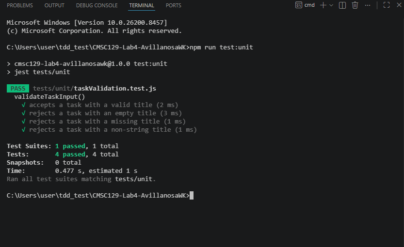
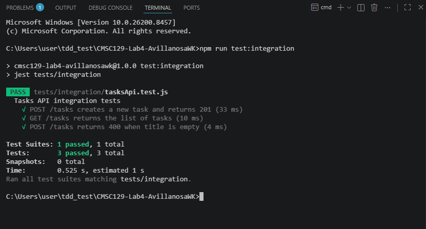
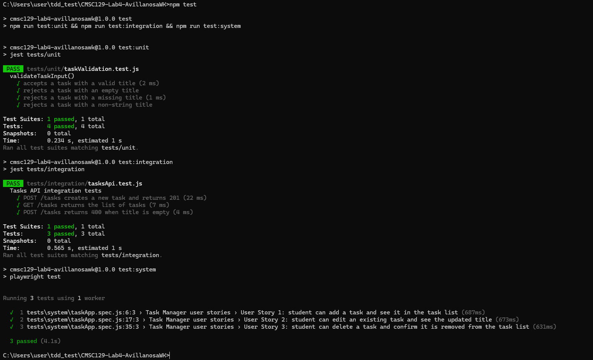
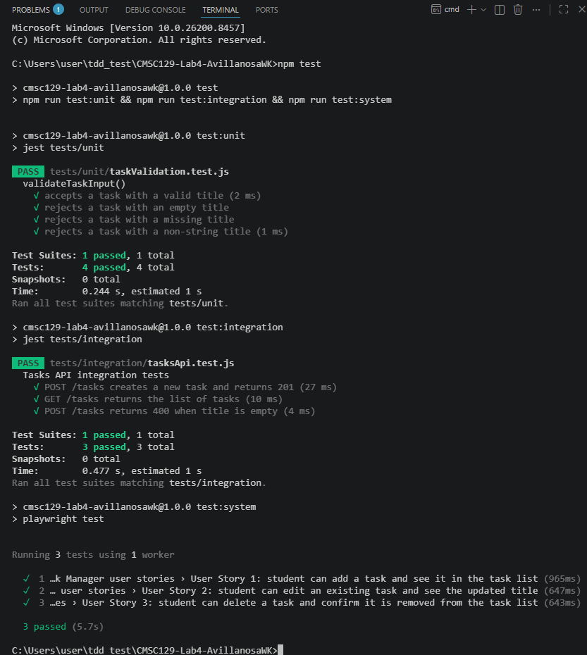

# Task Done Daily: Task Manager CRUD App

A simple single-resource CRUD web application for managing academic tasks. The app allows a student to create tasks, view the current task list, update existing tasks, and delete tasks that are no longer needed. This project is developed using Test-Driven Development (TDD), following the Red-Green-Refactor cycle across unit, integration, and system testing levels.

## Live URL

https://cmsc-129-lab4-avillanosa-wk.vercel.app

The deployed Vercel demo uses browser localStorage for task storage. The repository still includes the Express backend used for the integration testing portion of the TDD workflow.

## User Stories

1. As a student, I want to add a task, so that I can keep track of work I need to finish.

2. As a student, I want to edit a task, so that I can correct or update my task details.

3. As a student, I want to delete a task, so that I can remove tasks I no longer need.

## Tech Stack

### Application Stack

- Frontend: React with Vite
- Backend: Node.js with Express
- Data Storage: In-memory array on the backend
- Version Control: Git and GitHub

### Testing Tools

- Unit Testing: Jest
- Integration Testing: Jest with Supertest
- System / End-to-End Testing: Playwright
- CI/CD: GitHub Actions

## Application Resource

The application manages one resource: `Task`.

A task will contain the following basic fields:

```js
{
  id: 1,
  title: "Finish CMSC 129 Lab 4",
  completed: false
}
```

The application will support the following CRUD operations:

- Create a new task
- Read or view all tasks
- Update an existing task
- Delete an existing task

## Testing Strategy

This project will follow the Red-Green-Refactor cycle for each testing level.

### Unit Testing

Unit tests will focus on isolated business logic that does not depend on HTTP requests, browser behavior, or external storage. The planned unit test target is the task validation logic.

Planned unit test cases include:

- A task with a valid title should pass validation.
- A task with an empty title should fail validation.
- A task with a missing title should fail validation.
- A task with a non-string title should fail validation.

These tests will help ensure that invalid task data is rejected before it reaches the API or the user interface.

### Integration Testing

Integration tests will focus on the Express API routes working together with the task validation logic and the in-memory task store. These tests will use real HTTP request-response cycles through Supertest.

Planned integration test cases include:

- `POST /tasks` should create a new task and return the created task.
- `GET /tasks` should return the list of tasks.
- `POST /tasks` should return a validation error when the task title is invalid.
- `PUT /tasks/:id` should update an existing task.
- `DELETE /tasks/:id` should remove an existing task.

These tests will verify that the route handlers, request parsing, validation logic, and in-memory storage work together correctly.

### System Testing

System tests will use Playwright to simulate real user interactions in a browser. Each system test will correspond to one user story.

Planned system test cases include:

- User Story 1: A student can add a task and see it appear in the task list.
- User Story 2: A student can edit an existing task and see the updated task title.
- User Story 3: A student can delete a task and confirm that it is removed from the task list.

These tests will verify that the frontend, backend, and user interface work together from the user's perspective.

## TDD Process

This project will follow the required TDD cycle:

1. Red: Write failing tests first.
2. Green: Write the minimum implementation needed to make the tests pass.
3. Refactor: Improve the code structure without changing behavior.

Each major testing level will follow this order:

1. Unit tests with TDD
2. Integration tests with TDD
3. System tests with TDD

Commit messages will use the required prefixes:

- `[RED]` for failing test commits
- `[GREEN]` for minimum implementation commits
- `[REFACTOR]` for code cleanup commits
- `[DOCS]` for documentation updates

### Setup Instructions

These instructions will be updated as the project is implemented.

#### 1. Clone the repository
```bash
git clone <repository-url>
cd <repository-folder>
```
#### 2. Install dependencies
```bash
npm install
```
#### 3. Run the development servers
```bash
npm run dev
```
#### 4. Run unit tests
```bash
npm run test:unit
```
#### 5. Run integration tests
```bash
npm run test:integration
```
#### 6. Run system tests
```bash
npm run test:system
```
#### 7. Run all tests
```bash
npm test
```

### Test Results

#### Unit Test Results

The unit tests for task validation passed after the GREEN and REFACTOR phases.



#### Integration Test Results

The integration tests for the Task API passed after the GREEN and REFACTOR phases.



#### System Test Results

The system tests for the three user stories passed after the GREEN and REFACTOR phases.



#### Full Test Suite Results


The full test suite passed after completing the unit, integration, and system testing phases.



## CI/CD Setup

This project uses GitHub Actions for continuous integration. The workflow is defined in `.github/workflows/ci.yml`.

The workflow is triggered automatically on:

- Every push to the `main` branch
- Every pull request targeting the `main` branch

The CI pipeline performs the following steps:

1. Checks out the repository.
2. Sets up Node.js version 22.
3. Installs dependencies using `npm ci`.
4. Installs the Playwright Chromium browser using `npx playwright install --with-deps chromium`.
5. Runs the full test suite using `npm test`.

The full test suite includes:

- Unit tests with Jest
- Integration tests with Jest and Supertest
- System tests with Playwright

The Red-Green-Refactor process was verified through GitHub Actions:

- `[RED]` commits showed failing workflow runs because the expected implementation did not exist yet.
- `[GREEN]` commits showed passing workflow runs after the minimum implementation was added.
- `[REFACTOR]` commits showed passing workflow runs after code cleanup confirmed that behavior did not change.


## Reflection

Resisting the temptation to develop the functionality first was the hardest aspect of creating tests before code. 
<br>In earlier exercises, it was simpler to create the function, route, or user interface right away and then see if it worked. 
<br>We had to specify the intended behavior in this lab before we could write the real implementation. 
<br>The failed tests had to have meaning, which made this difficult. 
<br>A Red phase failure should result from behavior that does not yet exist rather than from a syntax error or missing setup. 
<br>The setup and commit order become more critical than normal as a result.

The way I designed the code changed by writing tests first, unlike the way I usually did before, one without using this kind of development. 
<br>The task validation logic needed to be isolated from the route handlers in order to be tested separately for the unit tests. 
<br>Supertest was able to test the API more easily because 
the Express app needed to be exportable for the integration tests without launching a server right away. 
<br>To enable Playwright to replicate actual user activities, the user interface for the system tests has to have predictable behavior and clear `data-testid` properties.

So, with all things considered, TDD promoted more structured project structures, simpler functionalities, and a clearer division between levels.

